# Geeetech A10M Chimera mod
A guide on how to install an E3D Chimera hotend on the Geeetech A10M, A20M, A30M and how to adapt other boards for dual extrusion.


# Summary

[Introduction](https://github.com/Keybored02/Geeetech-A10M-Chimera-mod#introduction)

[1.0: Reliable is not in the Chinese vocabulary](https://github.com/Keybored02/Geeetech-A10M-Chimera-mod#part-10-reliable-is-not-in-the-chinese-vocabulary)

[1.1: Solutions?](https://github.com/Keybored02/Geeetech-A10M-Chimera-mod#part-11-solutions)

[1.2: A 1-in-1 mod](https://github.com/Keybored02/Geeetech-A10M-Chimera-mod#part-12-a-1-in-1-mod)

[2.0: A 2-in-2 mod]()

[2.1: The board is the limit]()

[2.1-bis: The breakout board]()

[3.0: The idyllic scenario: wiring of a populated board]()

[3.1: Firmware for a populated board]()

[4.0: The apocalyptic scenario: unpopulated or different board]()

[4.1: Option 1: soldering the missing components]()

[4.2: Option 2: Repurposing existing pins]()

[5.0: Calibrations]()

# Introduction

I purchased my A10M for Christmas, with the intent of modding it to print dual materials at different temperatures (a thing quite hard on the stock model, as it has only one heating cartridge for both, forcing the temperature to fluctuate between the melting points of the 2 of them). I soon realized that the Cyclops-style hotend is not ideal if you’re printing with only one filament: melted material was flowing back through the other Bowden tube, the retraction was ineffective, oozing and stringing was unbearable. So, I decided that enough was enough.
I had two objectives:
1. Getting the printer to print reliably (spoiler, I can't)
2. Upgrade to a 2-in-2 Chimera hotend (for cheap)


# Part 1.0: Reliable is not in the Chinese vocabulary

Let's talk about the "original" 2-in-1 hotend. Inspired by the E3D Cyclops, it's an all-metal design with a single heating cartridge, an NTC-100k thermistor, and an M7-threaded nozzle. As far as I know, Geeetech produced 2 iterations of this extruder: the only difference is the heatsink design, the rest remains unchanged.

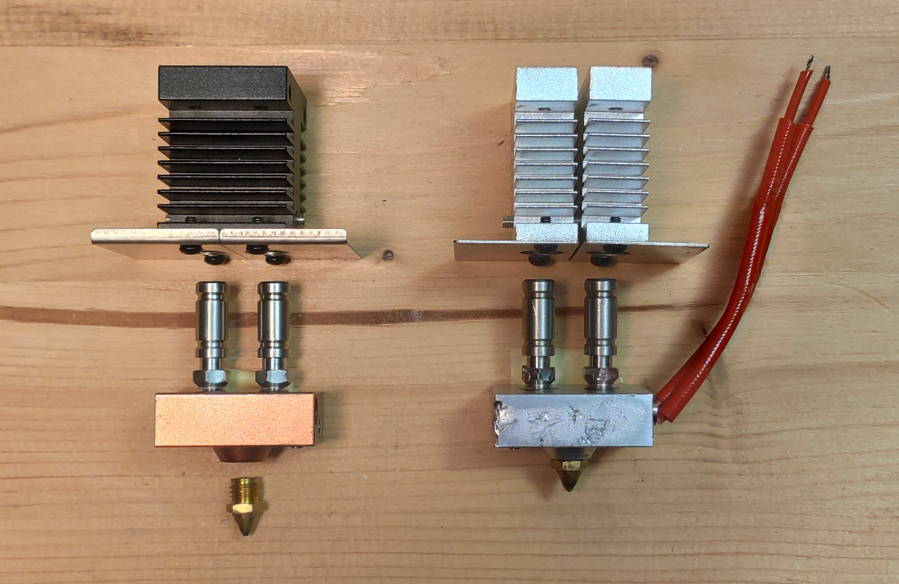

Geeetech implemented a few flaws in their design. First of all, anti-backflow disks. Tiny pieces of metal located between the heatbreak and the heat block that supposedly prevent the molten filament from climbing up the other throat. Not only they do not work (I still got a clogged Bowden), but they even limit retraction. In my experience, removing them changes very little. **NOTE: Factory firmware limits the retraction to 25mm/s, no matter the slicer's settings**

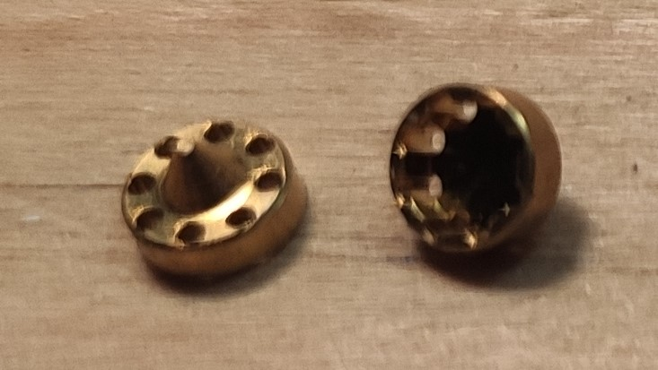 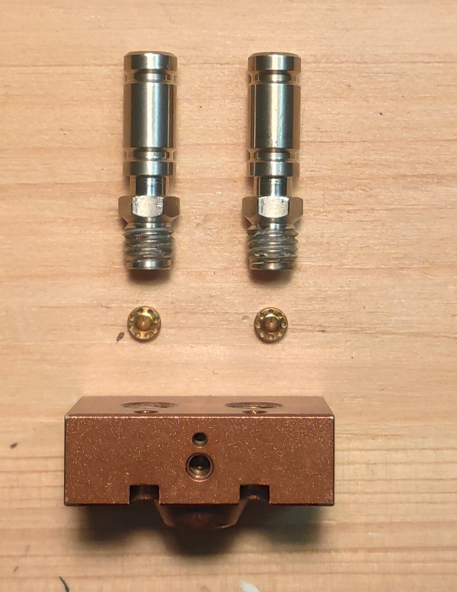


The other big issue is the amount of glue that holds all the screws on the heat block and the heatbreaks themselves. To unscrew them, you have to heat them at around 450°C with a heat gun. Otherwise, you'll just dent them (as shown in the image).

Now, let's talk about the flaws that are not Geeetech's fault. The 2-in-1 Cyclops (even the original one) hot ends are not designed to print with a single filament, but always with two. If you're experiencing unworldly oozing and stringing with only one filament, there's not much you can do. The following diagram explains it (it's theoretical, not checked or supported by anyone other than me):

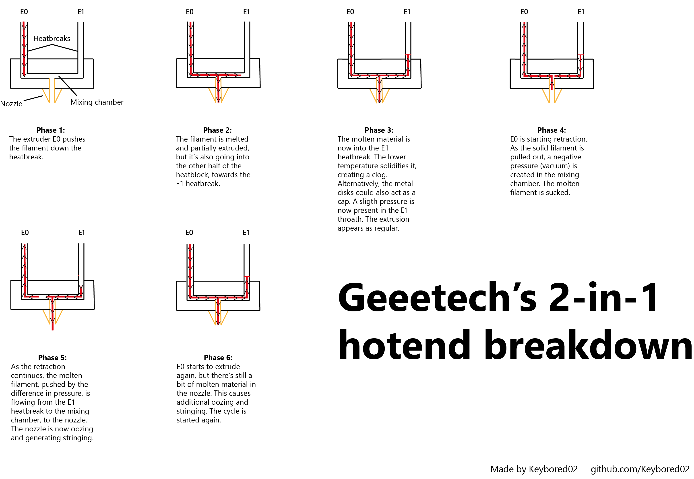

Consider also that the main difference between this and, let's say, a V6 hotend is the number of right angles that the filament has to go through before being extruded, and the fact that the length exposed to heat is bigger in the 2-in-1 (as the filament flows parallel to the heating cartridge, rather than perpendicularly), making it more similar to a Volcano hotend. Both of these elements need to be kept into consideration in our case.


# Part 1.1: Solutions?

Although this is pretty much unfixable (as it is a structural flaw), we can still do something to mitigate the issue:
1. Printing with 2 filaments at any given time. They can be of the same color (two identical spools at 50-50%), or different. While extruding 2 filaments you're also retracting from both sides, mitigating the aforementioned oozing. **NOTE: Materials of different colors can have different printing temperatures due to the pigments they incorporate.**

2. Sticking a piece of filament into the unused heatbreak. Make sure that the printing temperature of this one is substantially higher than the one of the material you'll be printing with.

3. Giving up color mixing (explained further later).


# Part 1.2: A 1-in-1 mod

The solution is a 1-in-1 or 2-in-2 mod. That's it. The design is flawed? Change the design.

Let's start from the easiest one, the 1-in-1. Assuming that you already have the 2-in-1 hotend, what you need is a V6 heat block:
* [Original V6 Heatblock (incompatible with the stock thermistor)](https://e3d-online.com/products/v6-heaterblock-for-sensor-cartridges)
* [Clone (compatible, select the unofficial one)](https://it.aliexpress.com/item/32849595265.html?spm=a2g0o.productlist.0.0.289a21c5BJL6ka&algo_pvid=2ea0c950-dbdc-4134-aab4-0d17e1c7d871&algo_expid=2ea0c950-dbdc-4134-aab4-0d17e1c7d871-7&btsid=2100bdd016128109868592368ecdc2&ws_ab_test=searchweb0_0,searchweb201602_,searchweb201603_)

By using the unofficial clone you can keep the awful stock thermistor and the heating cartridge. You'll still have to change the nozzle, as Geeetech uses M7 threading, and the V6 family uses M6. My suggestions:
* [E3D original](https://e3d-online.com/products/v6-nozzles)
* [Trianglelab (unofficial)](https://it.aliexpress.com/item/32965509920.html?spm=a2g0o.detail.100009.2.1ced540ek9SFEo&gps-id=pcDetailLeftTopSell&scm=1007.13482.95643.0&scm_id=1007.13482.95643.0&scm-url=1007.13482.95643.0&pvid=48714b26-6e22-44f8-85ef-789399836e91&_t=gps-id:pcDetailLeftTopSell,scm-url:1007.13482.95643.0,pvid:48714b26-6e22-44f8-85ef-789399836e91,tpp_buckets:668%230%23131923%23100_668%23888%233325%235_668%232846%238113%231998_668%232717%237563%23523_668%231000022185%231000066059%230_668%233480%2315683%23647)

Since you are already at it, why not upgrade it to a hardened steel one?

Now that you have all you need, you can uninstall the 2-in-1 following [this guide](https://github.com/caesar1111/Geeetech-A10M-HotEnd-Maintenance/blob/master/A10M_HotEnd_Maintenance.md). The assembly of the heatbreak-heat block(V6)-cartridge-thermistor is straightforward, and I won't cover it here. What I will cover instead is the heatsink placement:

* dual heatsink (silver): use only one heatsink, insert the previously assembled block, align the indentation, and screw in the heatbreak. Install the fans on the two sides. Screw the heatsink to the cage using the central holes (as shown in the picture).

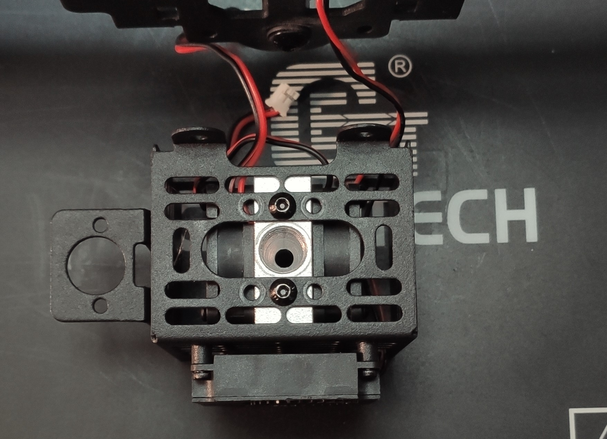

* Single heatsink (black): to fit in the cage, you need to remove one of the two metal shields at the bottom. Assemble the block, screw the heatbreak, mount only one fan above the remaining metal shield. Screw the heatsink to the cage using the central holes (as shown in the picture). You can attach the second fan externally using some zip ties. I don't recommend leaving the entire work to only one fan, since the thermal mass is considerable and the flow would cover only one side.

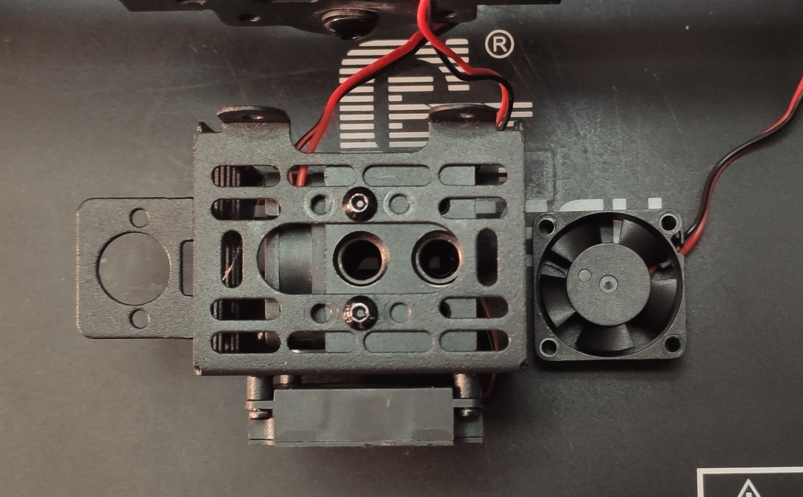

The result should look similar to an [A10 hotend](https://www.geeetech.com/geeetech-a10-a30-a30-pro-a20-3d-printer-24v-printing-head-p-1041.html).

Now that you have downgraded your A10M to an A10, lets' fix a couple of things: 

1. Level the bed.
2. Flash Marlin 2.0.x. You can follow [this video](https://www.youtube.com/watch?v=J14uJEd4XLU), but there are also many others that you can find. Besides all the cool new features, you'll also get the ability to change your retraction settings. The 1-in-1 mod doesn't require specific changes. If you already have Marlin 2.0 on your board, no re-flash is needed.
3. PID tuning. Since you've changed the thermal configuration of the hotend, a PID tuning could be helpful if you are seeing the temp readings fluctuate. Keep in mind that the thermistor is pretty inaccurate...[Video](https://www.youtube.com/watch?v=h9Rdid-T-Gw)
4. Calibration tests and benches. Run everything again: retraction and stringing tests, linear advance calibration, etc.

# Part 2.0: A 2-in-2 mod

Color mixing surely it's cool, but it's also a limiting factor that prevents the printer from getting consistent, single-extruder results. While going 1-in-1 as explained in Part 1.2 solves the issue, it's more of a downgrade than an improvement. You paid for two extruders, you have to use both of them!.
You can get a Dua Extruder set up quite easily with the help of the E3D's Chimera+, which is a heatsink with two hollowings for two separate heatbreaks. It's integrated into the V6 ecosystem, so you can use the block and nozzles from a normal V6 hot end (heatbreaks are different). 

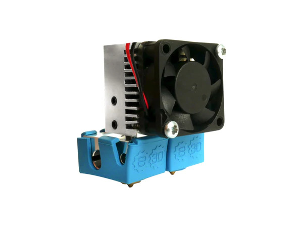

You can get the Chimera 
* [E3D Original](https://e3d-online.com/products/chimera)
* [Trianglelab clone](https://it.aliexpress.com/item/32908238691.html?spm=a2g0o.store_pc_allProduct.8148356.9.77b627c6nWPtjm)

A couple of considerations on the Trianglelab's clone: it's machined precisely, and I've had no problems adapting it to the Chimera+ CAD designs. Avoid extremely cheap off-brand clones (we'll talk about this later).

# Part 2.1: The board is the limit

If you're asking yourself: can I adapt my A10M/A20M/A30M/any printer to DualEx? The answer is: yes, under one condition. Your board must come with a header for a second thermistor and heating cartridge. What follows is a rant on the status of Geeetech boards.

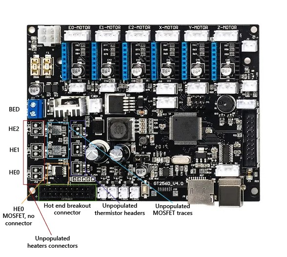

Up is a GT2560 v4.0 board used in the latest A10Ms and sold on the Geeetech online store. Notice anything wrong? The traces for Heater 1 (HE1) and Heater 2 (HE2) are not populated, while Heater 0 has only the MOSFET, without the connector. With this configuration, there's space only for one heater (which is already in use). If they already have the traces, why not use them? I'm sure that is not an unbearable expense to add a few connectors and SMD MOSFETs. You wanna know how I know that? Because on previous models, manufactured in 2019 and earlier (like the one I have), all traces are populated (image pulled from the [official forum](https://www.geeetech.com/forum/viewtopic.php?f=18&t=69799&start=30)).

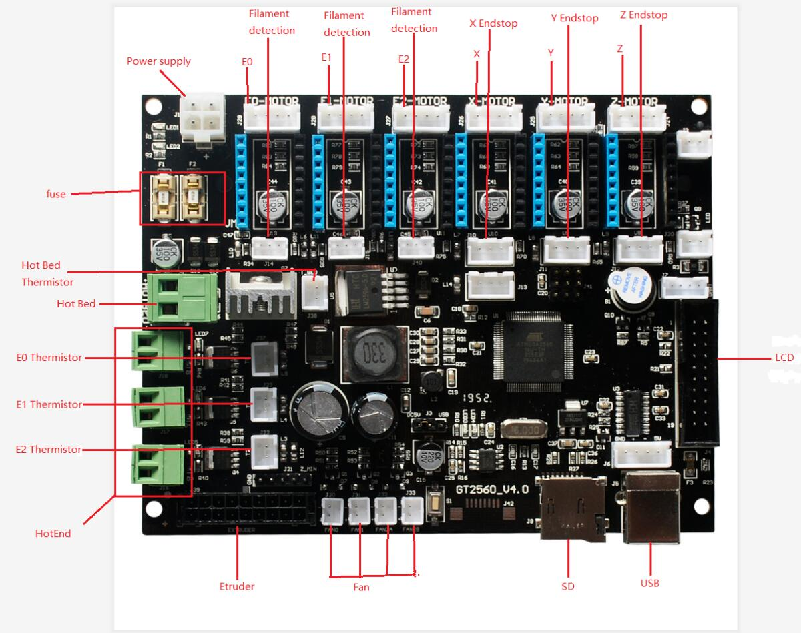

This happens on other Geeetech boards too, across all printers. 


To proceed with the mod, you'll have to open the hood and look at your board. If it has all the connections ready, good. Keep on reading. 
If it doesn't, jump to Part 4.0. It doesn't have to be a stock Geeetech board (as long as it meets the aforementioned requirements).

# Part 2.1-bis: The breakout board

A couple of additional considerations:
- The Molex connector that links the mainboard to the breakout board on the back of the X-axis carriage is a total mess. Albeit showing 4 headers labeled heater, they're not separated. They are wired in serially. In other words, it's just one line split across 4 ports. This puts a tremendous load on both ends in case 4 heaters are connected. Fire safety is a joke, isn't it? We cannot add a second extruder using that, it would be like duplicating the first. 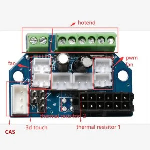
- What just said applies to fan and temp sensors too: it's one line, duplicated to two headers. If you run the math, it does add up: the breakout board's Molex is 2x6, so 12 pins. 6 less than what the mainboard has. Wired in are 2 pins for the HE0, 2 for the temp sensor, 2 for a constant fan and 2 for the PWM fan, 4 for the BLTouch probe (one common ground). Total = 12 pins. There's no space for other lines.
- On the mainboard side, the 2x9 connector is wired to HE1 and HE2, as well as T1 and T0 (labeling for thermistors). But wait a minute, if HE0 is actually what we're using (and we know it's connected), why doesn't the 2x9 list it? And why does it say that it connects to HE2, but not T2? It's piloting a heater without feedback? It's probably just a typo in the schematic but remains extremely confusing. 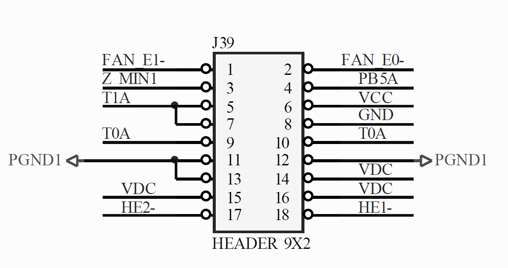
- **IMPORTANT:** The connector on the board is an alternative to the onboard connectors. It's wired in parallel to the HE0, HE1, T0, T1, Fan, BLtouch pins. In practical terms: you either use the connectors on the mainboard **OR** the ones on the breakout, because they're the same thing for the microcontroller. Wiring two separate heaters, one to the HE0 connector on the breakout board and one to HE0 on the mainboard it's a big no-no. The same thing applies to the fans, thermistors, and BLtouch of course.

# Part 3.0: The idyllic scenario: wiring of a populated board

First of all, a BOM of the parts.
[Chimera+ Kit](https://it.aliexpress.com/item/32907340102.html?spm=a2g0o.store_pc_allProduct.8148356.3.77b627c6nWPtjm) that includes:
- Chimera+ heatsink and couplers
- 2x Kraken (unofficial naming) heatbreaks
- 2x ATC Semitec 104GT-2/104NT-4-R025H42G thermistors (cartridges, no glass beads)
- 2x 16mm, 24V 40W V6 heating cartridges
- 2x V6 heatbreaks
- 2x V6 0.4mm nozzles
- 3010 24V fan

Not included, but recommended: 
  - 2x Silicon socks
  - 5015 24V fan 

Additional hardware: 
  - 3x M3 10mm screws
  - 2x M3 hexagonal nuts
  - 1x 20mm M3 nut and bolt (to hold the part fan)
  - Printed adapter plate
  - Printed fan duct
  
You can purchase it as an assembly-ready kit or mix match different parts, but these are the essentials. As mentioned previously, it's part of the V6 ecosystem.
You'll also have to print an adapter plate to mount to the carriage and a fan duct

Now that you have everything, let's start.

- **Remove the filament:** Heat the extruder(s) and remove the filament. Remove the Bowden tubes too.
- **Disassemble the X-axis carriage:** With the printer powered off and disconnected from the outlet, remove the fan shroud, disconnect the 2x6 Molex, remove the breakout board cover (two hex screws on the back of the carriage), and then unscrew the nuts that hold the wheels in place. Disconnect the heater cables, thermistor cables, and part cooling fan.
- **Assemble the Chimera:** Follow the [instructions](https://e3d-online.zendesk.com/hc/en-us/articles/360016354698-Chimera-Air-cooled-Assembly-Edition-1-)
- **Adapter mount:** I've designed a mount that is available on [Thingiverse](https://www.thingiverse.com/thing:4795634). It's designed to maintain the same Y dimension to minimize firmware changes. Press fit the nuts into their spots. You need 3x M3 10mm screws to screw in the Chimera, and you can reuse the factory screws to mount the plate to the carriage.
- **Wiring and cable management:** This is not as hard as it seems. Decide which one is Extruder 1 (usually the one on the left), and wire its heater to HE0 and its sensors to T0. Again, use the board connectors. If you have them, crimping ferrules for the heater's cables are a good thing to add. Polarity doesn't matter (there's no defined + or -). For Extruder 2 use HE1 and T1. Pass the cables through the cable slots on the adapter plate and then through the carriage. You can bundle the cables in the Molex connector's sleeve or zip-tie them on the exterior. Make sure they're not strained or under tension.
- **Fans:** I recommend using this fan duct with a 5015 fan from [Thingiverse](https://www.thingiverse.com/thing:2175956/files). The fan duct is mounted on top of the 3010 fan, using the included self-tapping screws. Be careful to tap in a straight line. Reconnect the heatsink and part fans on the back of the board (follow the aforementioned diagram) and level the height of the fan duct.
- **Reinsert the Bowden**: Don't insert the filament yet.

You can, of course, use different mounts and fan ducts. It shouldn't impact the wiring. 

Here's a photo mid-work
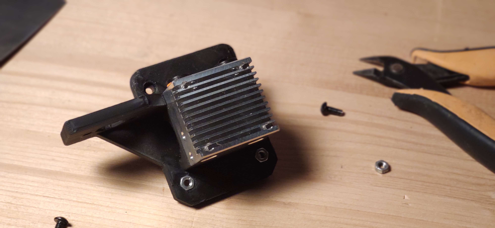

# Part 3.1: Firmware for a populated board

For the sake of keeping everything short, I won't include detailed info on how to compile Marlin, but only a brief run of the setting you need to change. 

First of all, check-in Configuration.h that the board definition you're using is correct. For me, it should be set as:

`#define MOTHERBOARD BOARD_GT2560_V3`

If you have a different MoBo, make sure to edit this. You can find a list of all boards under `Marlin\src\core\boards.h`.

Second of all, check that the pins for the second thermistor and heater are defined. In `Marlin\src\pins\mega\pins_GT2560_V3.h` I can see that they are all set correctly:
```
//
// Temperature Sensors
//
#define TEMP_0_PIN                            11  // Analog Input
#define TEMP_1_PIN                             9  // Analog Input
#define TEMP_2_PIN                             8  // Analog Input
#define TEMP_BED_PIN                          10  // Analog Input

//
// Heaters / Fans
//
#define HEATER_0_PIN                          10
#define HEATER_1_PIN                           3
#define HEATER_2_PIN                           2
#define HEATER_BED_PIN                         4
#define FAN_PIN                                9
#define FAN1_PIN                               8
#define FAN2_PIN                               7
```
If the pins for a second heater are not assigned, chances are they're not even present, refer to the manufacturer's schematic, or consult Part 4.2.

Uncomment

`#define EXTRUDERS 2`   

and make sure to comment out

`//#define MIXING_EXTRUDER`

Set the nozzles offset as
```
#define HOTEND_OFFSET_X { 0.0, 20.00 } // (mm) relative X-offset for each nozzle
#define HOTEND_OFFSET_Y { 0.0, 0.0 }  // (mm) relative Y-offset for each nozzle
```
This works for my adapter plate. Other designs might need a different `HOTEND_OFFSET_Y` value. `HOTEND_OFFSET_X` is defined by the geometry of the Chimera and remains unchanged no matter the adapter. 

In the `Thermal Settings` section, define the thermocouples you're using. If it's the included 104GT-2/104NT-4, set
```
#define TEMP_SENSOR_0 5 
#define TEMP_SENSOR_1 5 
```
otherwise, consult the thermistor table.

Set also
```
#define HEATER_0_MAXTEMP 285
#define HEATER_1_MAXTEMP 285
```
for the 104GT-2/104NT-4. `MAXTEMP` is 15°C higher, at 300°C. The extra headroom is a safety precaution.

Don't forget to define
```
#define HEATER_0_MINTEMP 5 
#define HEATER_1_MINTEMP 5
```
to avoid thermal runaway.

This only covers our new extruder setup. To compile Marlin from zero you'll need to define all the other variables too.

# Part 4.0: The apocalyptic scenario: unpopulated or different board

Now,  if you either have a GT2560 v4.0 board without the connectors or another board (but still without the desired connectors), you can choose 3 paths:

0. Buy another board. A BTT SKR 1.4/2.0, a BTT Octopus, an MKS Robin NANO V3, and so on.
1. Buy and solder the missing components
2. Re-purpose unused pins as HE0 and T0 headers, and use external MOSFETs modules

Option 0 is the most expensive but also the easiest method. Go this way if you're not comfortable with soldering. You can follow Part 3.0 and 3.1 (with the due diligence of changing board definition).

Option 1 is a bit more complicated and will differ from board to board as components and traces change. I recommend it only for those who can both source the components and solder them.

Option 2 is also not straightforward and will require a janky workaround. It's the less favorable of the 3.

**DISCLAIMER**: the following paragraphs should be considered an informative piece, and not a step-by-step guide. Due to the different revisions in existence, details and schematics may vary. Operating with electronics components is not recommended unless you know where you're putting your hands. The author takes no responsibility for damages to people and objects. Proceed at your own risk.

# Part 4.1: Option 1: soldering the missing components

As far as I'm aware, only the V4.0 and later (4.0B, 4.1) boards suffer from partially populated traces. V3.0 should be spared (I included the schematics anyway).
Usually, the non-populated traces belong to MOSFETs, red LEDs, a couple of resistors (100kOhms and 2.7kOhms), a diode, and a through-hole 2.54mm pitch headers for a JST XH-2.54 connector. 

I'm positive the package of the FET is a SOT669. By default, on the V4.0 is installed a PSMN7R0-30 series MOSFET, while the V3.0 uses specifically the PSMN7R0-30YL. I think they're the same and are just mislabeled in GT2560_V4.0_SCH.pdf, but I'm unable to verify this. 

The diodes are 1N5819 (DO-214AC or SOD-123F package, unable to verify). Schematics are included in this repository for those who want them. 
It should be as easy as soldering everything in. Pin definition stays the same. Of course, as long as they're within (or above) specs, you can use other components. Verify also that the traces are connected to the MCU and that ground is grounded. Asa reference, here's a brand new GT2560 V4.0, fully populated.
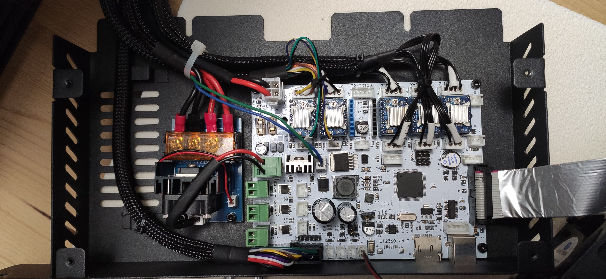

Follow Part 3.0 and 3.1 for wiring and firmware setup.

# Part 4.2: Option 2: Repurposing existing pins

Frankly, it's not a great idea to follow this path. It's not that cheaper, but most importantly it's a bad workaround.

The main idea here is to re-assign unused pins to the HE1 and T1 headers. The exact pins to use differ from user to user. For example, they could be

- from the free driver socket (plenty there)
- from the end-stops
- from the Bltouch connector

Of course, it's not as straightforward as plugging the connector in another spot and changing pin definition in firmware. You'll have to add a resistor and a capacitor to the mix (they're thermistors, after all). You can find the schematics in the Schematics folder. 

Once you set the new pin definition, you can add a separate MOSFET module.** DO NOT cheap out on those**. A bad MOSFET when breaks down does so in the open position. Current will keep flowing to your bed, and even thermal runaway protection can't save you in that case. A PSU shutoff relay is recommended (assuming you still have pins to control it).
[TriangleLab](https://it.aliexpress.com/item/32855369632.html?spm=a2g0o.store_pc_allProduct.8148356.5.92d56277lYWOKD) and [BigTreeTech](https://it.aliexpress.com/item/32827172643.html?spm=a2g0o.store_pc_allProduct.8148356.4.50a27d10rtKAvP) both have well-specced (on paper at least) 40A and 30A MOSFETs for a reasonable price.

Wiring for those is pretty straightforward. HOT +/- goes to the heater (polarity doesn't matter), SIG+/- goes to the redefined pins for HE1, POWER+/- to the PSU.

Once the wiring for the new thermistor and MOSFET is done, you can reassign the corresponding pins.

Let's say I'm not using the 3rd filament runout sensor and the enable pin from the E2 stepper driver.

Once I found my board in `Marlin\src\core\boards.h`, I can go to the respective file in `Marlin\src\pins`.

I'm gonna comment out (or delete) the definitions I'm changing
```
//#define E2_ENABLE_PIN                       41
//#define FIL_RUNOUT3_PIN                     54
```
and instead, I'm gonna add the lines
```
#define TEMP_1_PIN                            41 
#define HEATER_1_PIN                          54
```
with the pins of your choice.

You can now follow the instructions in Part 3.1 to complete the extruder setup.

# Part 5.0: Calibrations

Due to the significant changes we made, it's now important to run a set of calibration tests. In order:

1. Level the Z heigth of the two nozzles. With the two nozzles really close (but not in contact) with the bed, loosen the 4 grub screws on the side, and let both nozzles drop to the same height. Make sure to do so on a realtively flat spot of the bed (center should work fine). Check that they're actually leveled (push them down gently if not) and tigthen the grub screws really well. 
2. Adjust the Zmin end-stop or the BLtouch mount to avoid crushing the nozzles into the bed.
3. Set the Z probe-to-nozzle offset using nozzle 1 as a reference.
4. Run a PID tuning for both extruders (separately).
5. Run a full set of retraction, flow, temperature and linear advance.

